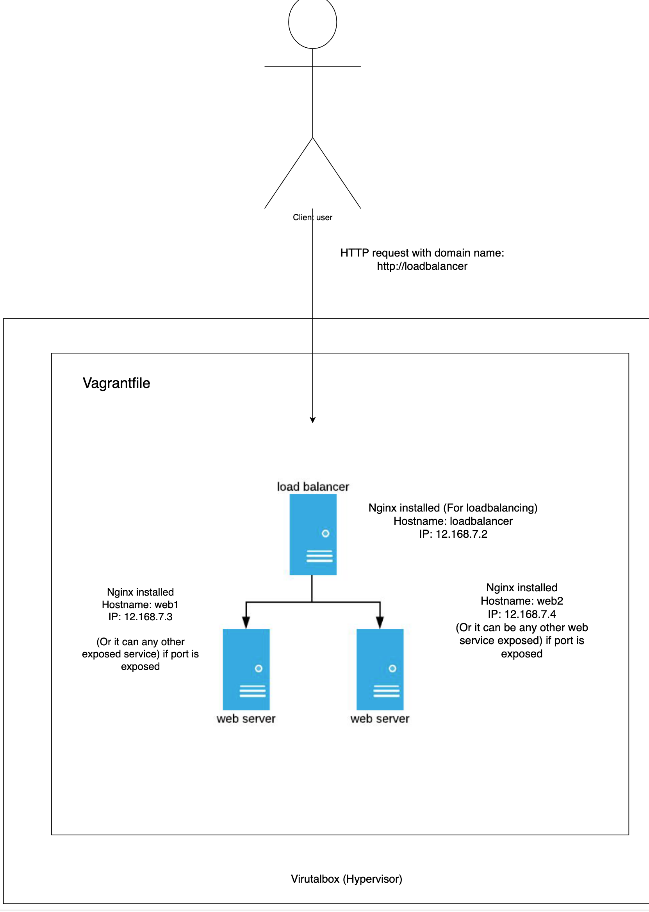

# AL test

Goal: To demo a local infrastructure deployment using vagrant, virtualbox, nginx, and ansible



- 1 VM as ingress / loadbalancer (nginx)
- 2 VM as nodes (Webservers)
- molecule test is used for idempotency

## Prerequisite
- Python and pip has been installed, if not, visit 
https://www.python.org/downloads/

## Setup 

TL;DR
- Install Vagrant and virtualbox
- Create a vagrant file with 3 Vms using ubuntu/bionic64
- Configure vagrant boxes with same CPU, memory and assign 3 different static ips and hostnames respectively
- Create ansible inventory file to specify vm connections
- Create a default molecule scenario
- Configure molecule create, destroy for vigorous unit testing
- Refactor and molecule test again!


## Development journey

### Install required pypi for running ansible and molecule 
```bash
$ pip install -r requirements.txt
```

- Create an ansible playbook with molecule to automate whole deployment (from vagrant up to nginx configuration, and http page test)

### a) Install vagrant and virtualbox
1. Download virtualbox 6.1.16 (as the time of writing)
```
https://download.virtualbox.org/virtualbox/6.1.16/VirtualBox-6.1.16-140961-OSX.dmg
```
2. Double click downloaded dmg file and follow prompted boxes to install

For other os distros, please visit
https://www.virtualbox.org/wiki/Downloads

3. Install vagrant
```
https://releases.hashicorp.com/vagrant/2.2.13/vagrant_2.2.13_x86_64.dmg
```
4. Double click dmg file and follow prompted boxes to install
Verify vagrant is installed correctly
```bash
$ vagrant --version
==> vagrant: A new version of Vagrant is available: 2.2.13 (installed version: 2.2.10)!
==> vagrant: To upgrade visit: https://www.vagrantup.com/downloads.html

Installed Version: 2.2.10
Latest Version: 2.2.13
```

### b) Create a vagrant file
https://app.vagrantup.com/ubuntu/boxes/bionic64


1. Using touch (you can use vim, vi editor or even vscode)
```bash
touch Vagrantfile
```
2. Following the official Hashicorp vagrant config
```
Vagrant.configure("2") do |config|
  config.vm.box = "ubuntu/bionic64"
end
```

We would then create a do while loop to create all 3 VMs
```
Vagrant.configure(VAGRANTFILE_API_VERSION) do |config|
    config.vm.box = "ubuntu/bionic64"
    config.ssh.insert_key = false
    config.vm.provider "virtualbox"
    config.vm.synced_folder '.', '/vagrant', disabled: true
end
```

3. Configure all 3 Vms with same CPU, RAM, private IP and hostname
```
# -*- mode: ruby -*-
# vi: set ft=ruby :

VAGRANTFILE_API_VERSION = "2"

Vagrant.configure(VAGRANTFILE_API_VERSION) do |config|
    config.vm.box = "ubuntu/bionic64"
    config.ssh.insert_key = false
    config.vm.provider "virtualbox"
    config.vm.synced_folder '.', '/vagrant', disabled: true

    config.vm.provider :virtualbox do |v|
        v.memory = 2048
        v.cpus = 2
        v.linked_clone = true
        v.customize ['modifyvm', :id, '--audio', 'none']
    end

    # Define three Vms with static private ip
    boxes = [
        { :name => "loadbalancer", :ip => "12.168.7.2" },
        { :name => "web1", :ip => "12.168.7.3" },
        { :name => "web2", :ip => "12.168.7.4" }
    ]

    # Configure each of the Vms hostnames
    boxes.each_with_index do |opts, index|
        config.vm.define opts[:name] do |config|
            config.vm.hostname = opts[:name] + ".cluster.test"
            config.vm.network "private_network", ip: opts[:ip]
        end
    end

end

```
4. Standup all 3 VMs
```bash
$ vagrant up
```

5. Verify if vms are all configured, you can ssh into each one of them
```
$ vagrant ssh loadbalancer
vagrant ssh loadbalancer
Welcome to Ubuntu 18.04.5 LTS (GNU/Linux 4.15.0-123-generic x86_64)
```
As example output if configured successfully

### c) Create ansible inventory file

Ansible uses inventory to specify correct "host" to connect and do "tasks".
1. Create "inventory" file
```bash
touch inventory
```
2. Paste this code into inventory
```
[kube]
loadbalancer ansible_host=12.168.7.2
web1 ansible_host=12.168.7.3
web2 ansible_host=12.168.7.4

[kube:vars]
ansible_ssh_user=vagrant
ansible_ssh_private_key_file=~/.vagrant.d/insecure_private_key
```

Above code do 2 things,
- Define `kube` group individual variables `ansible_host`
- Define `kube `group common shared variables `ansible_ssh_user` and `ansible_ssh_private_key_file`


### d) Create a default molecule scenario
```bash
$ molecule init scenario
```

### e) Configure molecule create, converge, destroy
To create and destroy vagrant boxes automatically

### f) Create a jinja2 template for nginx deployment test

- Modify the default /var/www/html/index.nginx-debian.html to insert each vm hostname

This is in ansible role /roles/nginx/tasks/index.nginx-debian.html.j2

To allow testing of loadbalancer nginx is correct forwarding traffic :)


### g) Modify nginx loadbalancer to redirect traffic to other 2 VMs

You can modify the loadbalancer_config.j2 template to add nginx rules.

This expose all backend pool
```
upstream backend {
  #server 12.168.7.2; This is the loadbalancer IP (Which we don't expose)
  server 12.168.7.3;
  server 12.168.7.4;
}

```

And traffic will be loadbalanced into two vms running nginx server with the defined upstream `backend` above

Example: 
```
server{
    location / {
            proxy_pass http://backend;
    }
}
```


Additional stragety of loadbalance rule can be configured.
1. There are multiple available loadbalancing method in nginx, more info please visit
(https://docs.nginx.com/nginx/admin-guide/load-balancer/http-load-balancer/)

2. As an example, I choose the `least_conn` loadbalancing method
This method will pass any web request to server with least number of active connections.
```
upstream backend {
    least_conn;
    server 12.168.7.3;
    server 12.168.7.4;
}
```

# Molecule test commands

This will run complete test from create, converge, idempotence, verify and destroy
```bash
$ molecule test
```

Just create the vms
```bash
$ molecule create
```

Testing continously on created VMs
```bash
$ molecule converge && molecule verify
```

Linting
```bash
$ molecule lint
```

Testing for idempotency
```bash
$ molecule idempotence
```

Debug
```bash
$ molecule --debug <lint/test/create/converge/idempotence/verify/destroy etc etc>
```


# Possible improvements idea
Obviously, this is far from actual production like environment where we would be using actual cloud vms, different applications, remote storage mounts and databases.

Considering this particular `local developement`
- Local vagrant vm with docker image and kubernetes cluster can be used insteada of creating 3 VMs --> 1 VM only is needed
- Could install another actual app like wordpress app that uses MySQL and PHP to be more PROD like
- Pipeline can be implemented when pushing code (Jenkinsfile, ADO template, github workflow)

HAVE FUN HACKING!